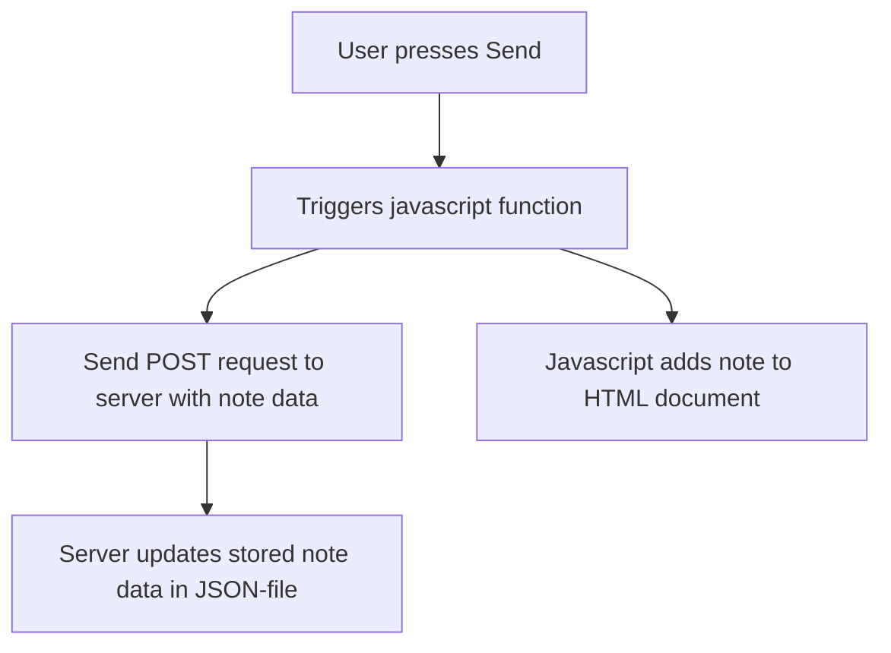

```mermaid
graph TD
A[User presses Send] --> B[Triggers javascript function]
B--> C[Send POST request to server with note data]
C--> D[Server updates stored note data in JSON-file]
B--> E[Javascript adds note to HTML document]

```
